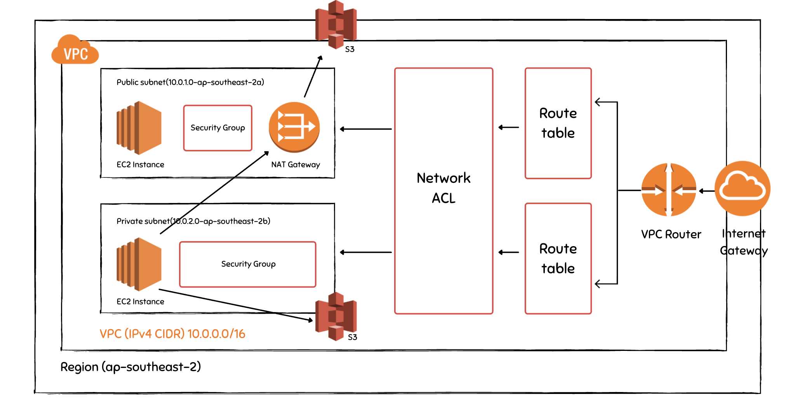
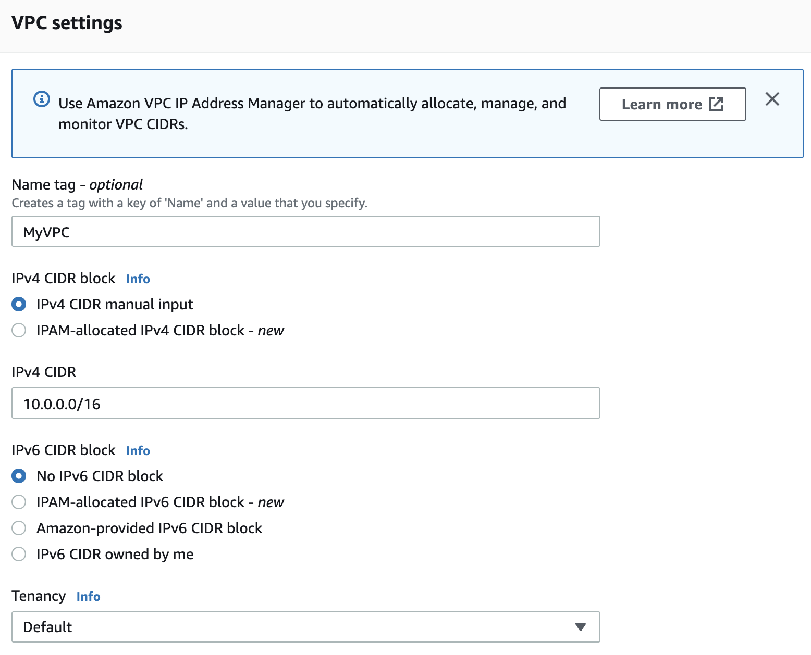
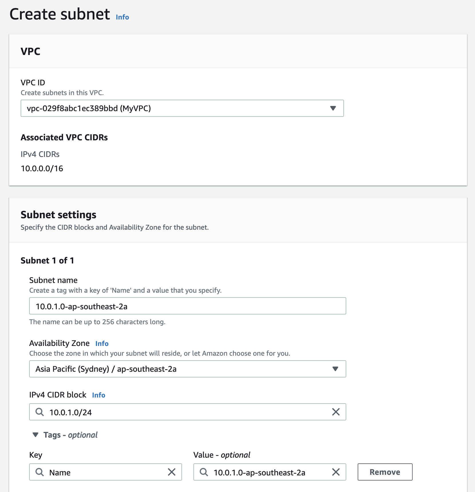
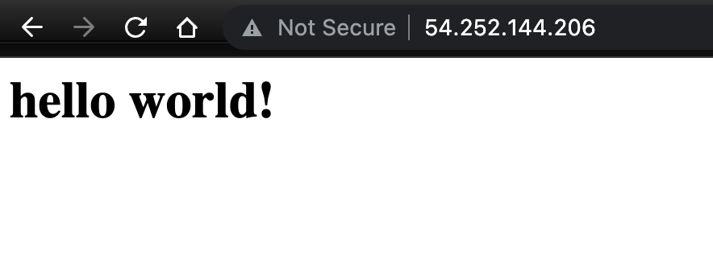

# How to Create a VPC in AWS: Step by Step Tutorial

In this tutorial, we'll go through the steps to create an AWS VPC with public and private subnets, and enable public subnet and private subnet access through a NAT Gateway and Endpoints.

We'll be using the AWS Management Console ([https://aws.amazon.com/console/](https://aws.amazon.com/console/)) to build all of the following things in the tutorial:

* A new VPC
* Two subnets
  * one is private
  * one is public
* A Route table
* An internet gateway
* A Network ACL
* A NAT gateway
* A Endpoints



# Tutorial Contents
* [Step 1: Create a new VPC](#step-1-create-a-new-vpc)
* [Step 2: Add subnets](#step-2-add-subnets)
* [Step 3: Add Internet Gateway](#step-3-add-internet-gateway)
* [Step 4: Add Route table for public subnet](#step-4-add-route-table-for-public-subnet)
* [Step 5: Enable public subnet to access the internet](#step-5-enable-public-subnet-to-access-the-internet)
* [Step 6: Enable private subnet to access the internet](#step-6-enable-private-subnet-to-access-the-internet)
* [Step 7: Validate VPC Connection on MAC OS](#step-7-validate-vpc-connection-on-mac-os)
* [Step 8 : Control traffic to public subnet with Network ACLs](#step-8-control-traffic-to-public-subnet-with-network-acls-optional-step) (Optional Step)
* [Step 9: Accessing S3 from a private subnet](#step-9-accessing-s3-from-a-private-subnet-optional-step) (Optional Step)
* [Step 10. Remove everything from AWS (Clean up)](#step-10-remove-everything-from-aws-clean-up)

# Step 1: Create a new VPC
1. Open the Amazon VPC console at [https://console.aws.amazon.com/vpc/](https://console.aws.amazon.com/vpc/)
2. Create VPC and entering the following inormation:
   * `Name tag` (optional): MyVPC
   * `IPv4 CIDR bloc`k: IPv4 CIDR manual input
   * `IPv4 CIDR`: 10.0.0.0/16
   * `IPv6 CIDR block`: select No IPv6 CIDR block
   * `Tenancy`: Default



> **Check sidebar** after create a new VPC (the id like vpc-0d1a683b1e975baed)
> * **Subnet**: no new subnet
> * Route tables: generate a new table
> * **Internet Gateways**: no new gateway
>   * means you can't access the internet
> * Network ACLs: generate a new ACLs
> * Security Groups: generate a new Groups


# Step 2:  Add subnets
Create two subnets in this step.  One subnet for the future public using, one subnet for future private using. 

The custom VPC wizard doesn't create any subnet, so you must manually create the subnets.

## Create First Subnet

1. In the navigation pane, select **Subnets.**
2. Create the first subnet and entering the following inormation:
   * `VPC ID` : vpc-0d1a683b1e975baed(My VPC)
   * `Subnet name`: 10.0.1.0-ap-southeast-2a
   * `Availability Zone`: ap-southeast-2a
   * `IPv4 CIDR block`:10.0.1.0/24



> **VPC ID**
> Select your VPC. This is the VPC we created in the [Step 1](#1.-create-vpc). In here and the following steps, I will abbreviate my VPC, i.e. vpc-0d1a683b1e975baed(My VPC).
> 
> **Availability Zone**
> 
> Select any Availability Zone in your region.
> 
> **Subnet name**
> 
> You can custom your subnet name, mine is based on my Availability Zone for convenience

## Create Second Subnet

Create the second subnet and entering the following inormation:

* `VPC ID` : vpc-0d1a683b1e975baed(My VPC)
* `Subnet name`: 10.0.2.0-ap-southeast-2b
* `Availability Zone`: ap-southeast-2b
* `IPv4 CIDR block`:10.0.2.0/24

.png)

# Step 3: Add Internet Gateway

The following describes how to manually create a ~~public~~ subnet and attach an internet gateway to your VPC to support internet access.

1. In the navigation pane, select **Internet Gateway.**
2. Create internet gateway and entering the following inormation:
   * `Name tag (optional)`: myInternetGateway
3. Attach the internet gateway to your VPC
   * Select the **internet gateway** that you just created
   * Click **Actions**
   * Click **Attach to VPC**
     * `Available VPCs`：'vpc-0d1a683b1e975baed(My VPC)'

.png)

> * An Internet gateway only attch a specific VPC, and a VPC only attach an internet gateway.
> * Build Internet gateway doesn't mean that you can access internet, instead you need to check Route Tables.

# Step 4: Add Route table for public subnet

When you create the VPC, Amazon automatically associate it with the main route table. By default, the main route table doesn't contain a route to an internet gateway. The following procedure creates a custom route table with a route that sends traffic destined outside the VPC to the internet gateway, and then associates it with your subnet.

## Create a custom route table

1. In the navigation pane, select **Route Tables.**
2. Create route table and entering the following inormation:
   * `Name`(custom): MyInternetRouteTable
   * `VPC`: vpc-0d1a683b1e975baed(My VPC)

## Configure custom Route Table

### **Modify Routs**

1. Select the custom route table (MyInternetRouteTable) that you just created.
2. On the **Routes** tab, choose **Edit routes**, **Add route**, and add the following routes as necessary:
   * `Destination`: 0.0.0.0/0
   * `Target`: Internet Gateway

> **Routes Destination**
>
> * Destination 10.0.0.0/16, access internal network
> * Destination 0.0.0.0/0, access internet

### **Modify Subnet associations**

1. On the **Subnet associations** tab, choose **Edit subnet associations** in **Explicit subnet assocaitons** window, select the check box for the subnet will become a public subnet.
   * `Select subnet: 10.0.1.0-ap-southeast-2a`

.png)

# Step 5: Enable public subnet to access the internet

1. In the navigation pane, select **Subnets.**
2. Select the subnet you would like to make it publicable. In the Step 4, I have set subnet '10.0.1.0-ap-southeast-2a' as public.
3. Click **Action** and Edit **subnet settings**:
   * `Select 'Enable auto-assign public IPv4 address'`

.png)

# Step 6: Enable private subnet to access the internet

NAT gateway help your instance in a private subnet of a VPC to connect securely over the internet or things like software updates and package downloads. However, the internet cannot access your private instance.

### **Create a  NAT Gateways**

1. In the navigation pane, select **NAT Gateways.**
2. Create NAT gateway and entering the following information:
   * **`Name`**`(custom)`: myNATgateway
   * **`Subnet`**: select the public subnet (10.0.1.0-ap-southeast-2a)
   * **`Elastic IP allocation ID`**: click Allocate Elastic IP

### **Add NAT Gateway to private route table**

1. In the navigation pane, select **Route table.**
2. Select the **route table with private subnet**, which is the default route table generated from the VPC was created, instead of the custom route table (myRoutetable) which created in the step 4.
3. Click **Routes** tab in the detailed pane, **Edit routes**, and entering the following information
   1. **`Destination`**: 0.0.0.0/0
   2. **`Target`**: NAT Gateway (which will resemble "nat-xxxxxxx")

So far, we have successfully created a VPC, if you wan to test your VPC, please continue try the example below.

# Step 7:  Validate VPC Connection (MAC OS)

## Prerequisites

Create two EC2 Instance in Amazon EC2 console, one as EC2 Instance in the public subnet, another as EC2 Instance in the private subnet.

**Instance in th public subnet Configuration**

* **`Name`**`(custom):`publicInstance
* **`Network`**: the custom VPC created, which will resemble "vpc-xxxxxxxx(My VPC)"
* **`Subnet`**: public subnet we created  (10.0.1.0-ap-southeast-2a)
* **`Security Group`**: add SSH, HTTP, HTTPs

**Instance in the private subnet Configuration**

* **`Name`**`(custom):`privateInstance
* **`Network`**:  the custom VPC created, which will resemble "vpc-xxxxxxxx(My VPC)"
* **`Subnet`**: private subnet we created  (10.0.2.0-ap-southeast-2b)
* **`Security Group`**: add SSH

After you create the instances, make note of their Public IPv4 address ID, which will resemble "xx.xxx.xx.xx".

## Access Instance in public subnet

Open a command prompt or shell

```powershell
# open ec2 private key folder 
% cd ~/aws_erc2_testing
% ls -lrht

# connect to erc server 
# ssh -i "ap-southeast-2-key(ec2).cer" ec2-user@Public IPv4 address of your publicInstance 
% ssh -i "ap-southeast-2-key(ec2).cer" ec2-user@54.252.144.206

# Are you sure you want to continue connecting (yes/no/[fingerprint])? 
% yes
```
.png)

```powershell
# Run "sudo yum update" to apply all updates
$ sudo yum update

# Is this ok [y/d/N]: 
$ y
```

## Access Instance in private subnet

```powershell
# Exit from your publicInstance to your root user
$ exit 

# copy private key to publicInstance 
% scp -i "ap-southeast-2-key(ec2).cer" ./"ap-southeast-2-key(ec2).cer" ec2-user@54.252.144.206:~/

# connect to publicInstance again
% ssh -i "ap-southeast-2-key(ec2).cer" ec2-user@54.252.144.206

# check the copy of private key in publicInstance
% ls -lrht

# if successfully copied, access privateInstance 
#ssh -i "ap-southeast-2-key(ec2).cer" ec2-user@IPv4_addresses of privateInstance
% ssh -i "ap-southeast-2-key(ec2).cer" ec2-user@10.0.2.203

#Are you sure you want to continue connecting (yes/no)? 
% yes 

#Run "sudo yum update" to apply all updates private instance
% sudo yum update
```

.png)

# Step 8 : Control traffic to public subnet with Network ACLs (Optional Step)

## Create a custom Network ACLs

1. Open the Amazon VPC console at [https://console.aws.amazon.com/vpc/](https://console.aws.amazon.com/vpc/).
2. In the navigation pane, choose **Network ACLs**.
3. Create network ACLs and entering the following information:
   * **`Name`**(custom): MyNetworkACL
   * **`VPC`**:  the custom VPC created in step1, which will resemble "vpc-xxxxxxxx(My VPC)"

## Associate a subnet with custom network ACL

1. Click **Subnet associations** tab in the details pane
2. **Edit** subnet associations, Select **public subnet** (10.0.1.0-ap-southeast-2a).

## Add Inbound rules to custom network ACL

1. Select **Inbound rules** tab in the details pane.
2. Edit Inbound rules and entering the foolowing information:
   * Add new rule
     * **`Rule number`**: 100
     * **`Type`**:  SSH(22)
     * **`Source`**: 0.0.0.0/0
     * **`Allow/Deny`**: Allow
   * Add new rule
     * **`Rule number`**: 200
     * **`Type`**:  HTTP(80)
     * **`Source`**: 0.0.0.0/0
     * **`Allow/Deny`**: Allow

## Add Outbound rules to custom network ACL

1. Select **Outbound rules** tab in the details pane.
2. Edit Outbound rules and entering the foolowing information:
   * Add new rule
     * **`Rule number`**: 100
     * **`Type`**:  SSH(22)
     * **`Source`**: 0.0.0.0/0
     * **`Allow/Deny`**: Allow
   * Add new rule
     * **`Rule number`**: 200
     * **`Type`**:  HTTP(80)
     * **`Source`**: 0.0.0.0/0
     * **`Allow/Deny`**: Allow
   * Add new rule
     * **`Rule number`**: 300
     * **`Type`**:  Custom TCP
     * **`Port range`**: 1024-65535
     * **`Source`**: 0.0.0.0/0
     * **`Allow/Deny`**: Allow

## Install a server

1. Install the Apache web server on Instance in the public subnet

```powershell
# If you still in the private subnet, exit to your public subnet
$ exit 

# If your pipe broken, re-connect your public subnet 
% ssh -i "ap-southeast-2-key(ec2).cer" ec2-user@54.252.144.206

# Install the Apache web server. 
$ sudo yum install httpd -y

# go to the directory /var/www/html
$ cd /var/www/html

# Create a new file in the html directory, and named inxdex.html
$ vim index.html

# insert sample code in the inxdex.html and save 
<html><h1>hello world!</h1></html>

# Start the web server with the command shown following
$ service httpd start
```

2. Test your server



## Filter traffic passing from the network to the local

Change the inbound rules of the Network ACLs can controlling traffic from the network to the public subnet.

1. Select **Inbound rules** tab in the Network ACLs details pane.
2. Edit Inbound rules and entering the foolowing information:
   * Add new rule
     * **`Rule number`**: 199
     * **`Type`**:  HTTP(80)
     * **`Source`**: 0.0.0.0/0
     * **`Allow/Deny`**: Deny

.png)

3. Access to the public IP Address again.

.png)

> **Rule number**
> 
> * Rules are evaluated starting with the lowest numbered rule, it's applied regardless of  the > ALLOW or DENY of any higher-numbered rule.
> * If you set a DENY inbound rule , but the public IP Address still can be accessed, the reason for that is rule number.
>   * The lower the rule number, the higher of the priority.

# Step 9: Accessing S3 from a private subnet (Optional Step)

## Preparation

* If you ran the above testing - [Control traffic to public subnet with Network ACLs](#testing-control-traffic-to-subnet-with-network-acls), please attach the public subnet (10.0.1.0-ap-southeast-2a) to the default Network ACLs by MyVPC, other wise the private EC2 Instance is unable access to test S3 bucket.
  1. In the navigation pane of VPC console, choose **Network ACLs**.
  2. Select the **default Network ACL** generated when your custom VPC was created, instead of the custom network ACL.
  3. Select **Subnet associations** tab in the Network ACLs details pane, then **Edit**
  4. Select the **public subnet** you created.  (10.0.1.0-ap-southeast-2a)
* Modify IAM role of your EC2 Instance. Please attach the **S3 Full Access policy** to your IAM Role.

## Access S3 Bucket by NAT Gateway

```powershell
#if you pipe broken or timeout, access in public EC2 Instance first
%  ssh -i "ap-southeast-2-key(ec2).cer" ec2-user@54.252.144.206

# access Private EC2 Instance 
$ ssh -i "ap-southeast-2-key(ec2).cer" ec2-user@10.0.2.203

# access S3 bucket 
$ aws s3 ls
```

## Access S3 via VPC Endpoint

You can access an S3 bucket privately without authentication when you access the bucket from an VPC. However, make sure that the VPC endpoint used points to Amazon S3. Follow below steps to set up VPC endpoint access to the S3 bucket.

## Update the route table of the private subnet

1. In the navigation pane, select **Route Tables.**
2. Select **the default route table** generated when your custom VPC was created, instead of the custom route table which created in the step 4.
3. Click **Routes** tab in the detailed pane, Edit **Routes**, and remove the following information
   * **`Destination`**: 0.0.0.0/0
   * **`Target`**: NAT Gateway (which will resemble "nat-xxxxxxx")

## Create a VPC endpoint for Amazon S3

1. In the navigation pane, select **Endpoints.**
2.  Create Endpoint and enter the following information:

    * **`Name/tag`**`(custom)`: myEndpoint
    * **`Service category`**: AWS services
    * **`Services`**: select the "s3" service name and "Gateway" type. For example, com.amazonaws.ap-southeast-2.s3, amazon, Gateway
    * `VPC`:  the custom VPC, which will resemble "vpc-xxxxxxxx(My VPC)"
    * `Route tables:` default route table of the custom VPC.


3. Access S3 in shell  

```powershell
$ aws s3 ls --region ap-southeast-2
```

# Step 10. Remove everything from AWS (Clean up)

1. Terminate EC2 Instances in the first
2. Delete custom Endpoint
3. Delete custom Route table
   * Remove associate subnet from custom Route table
   * Delete custom Route
4. Delete custom NAT Gateway
5. Detach custom Internet gateways from VPC
6. Delete custom VPC
7. Release Elastic IP Address